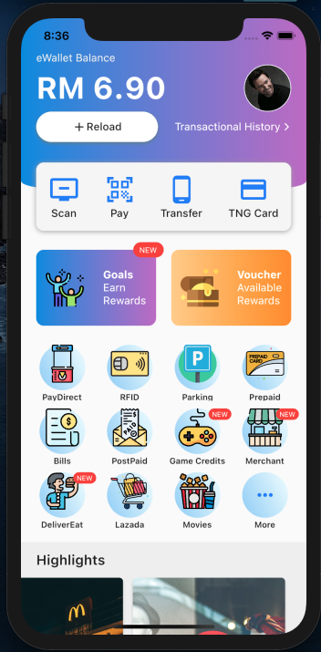
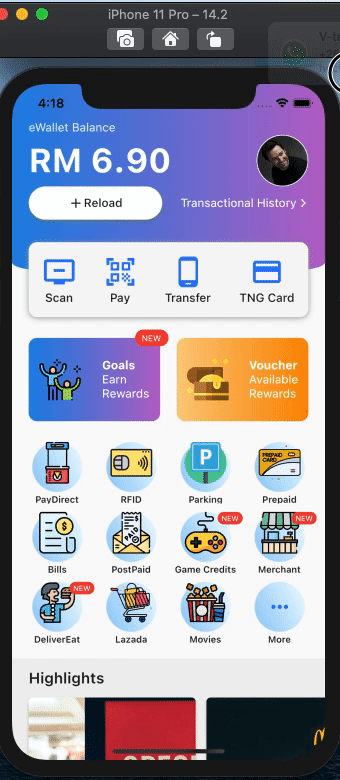

# TouchNGo app clone in Flutter

The Touch 'n Go smart card is used by Malaysian toll expressway and highway operators as the sole electronic payment system (https://www.touchngo.com.my).

## Flutter

The project is for personal development study. For better data & file structuring, see Marcus Ng on Youtube for better tutorial (https://www.youtube.com/channel/UC6Dy0rQ6zDnQuHQ1EeErGUA).

## Demo
\
## Animation

## PullToRefresh

